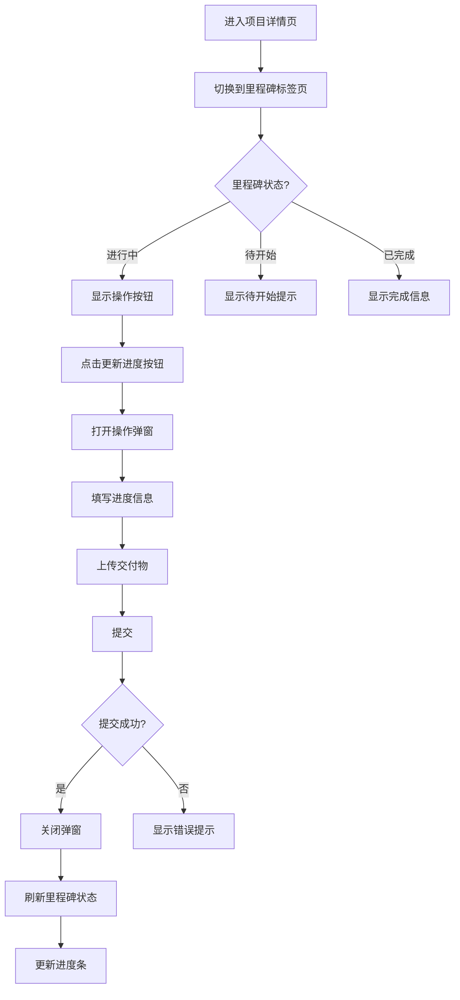
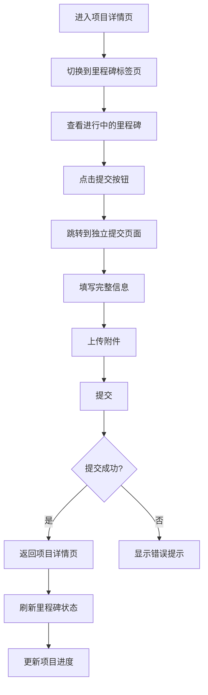

# 承接方里程碑操作交互设计方案

## 📋 设计概述

本文档设计承接方（学生/团队）在各个里程碑节点的操作交互方式，包括操作入口、交互形式、页面布局等。

---

## 🎯 设计原则

1. **一致性**：里程碑与项目阶段（projectSteps）保持一致
2. **便捷性**：操作入口清晰，交互流程简单
3. **可追溯性**：所有操作都有记录，便于追踪
4. **权限控制**：仅项目参与者（承接方和发布方）可进行操作

---

## 📊 里程碑与项目阶段对应关系

### 阶段映射表

| 项目阶段 | 阶段代码 | 对应里程碑 | 里程碑代码 | 操作类型 |
|---------|---------|-----------|-----------|---------|
| 揭榜征集 | BIDDING | - | - | 无（系统自动） |
| 方案提交 | PROPOSAL | 方案提交完成 | PROPOSAL_SUBMIT | 独立页面 |
| 项目执行 | EXECUTION | 项目启动会 | PROJECT_START | 弹窗操作 |
| 项目执行 | EXECUTION | 需求分析完成 | REQUIREMENT_ANALYSIS | 弹窗操作 |
| 项目执行 | EXECUTION | 系统设计完成 | SYSTEM_DESIGN | 弹窗操作 |
| 项目执行 | EXECUTION | 核心功能开发完成 | CORE_DEVELOPMENT | 弹窗操作 |
| 项目执行 | EXECUTION | 周报/月报提交 | WEEKLY_REPORT | 弹窗操作（可多次） |
| 中期答辩 | MIDTERM | 中期答辩 | MIDTERM_DEFENSE | 独立页面 |
| 成果提交 | DELIVERY | 成果提交 | FINAL_DELIVERY | 独立页面 |
| 成果评审 | REVIEW | - | - | 无（评审方操作） |
| 结项公示 | ANNOUNCEMENT | - | - | 无（系统自动） |

---

## 🎨 交互设计方案

### 方案一：混合模式（推荐）⭐

**核心思路**：
- **简单操作**（更新进度、提交周报）→ 使用**弹窗**
- **复杂操作**（方案提交、中期答辩、成果提交）→ 使用**独立页面**

#### 1. 简单操作：弹窗模式

**适用场景**：
- 项目启动会确认
- 需求分析完成
- 系统设计完成
- 核心功能开发完成
- 周报/月报提交

**交互流程**：
```
项目详情页 → 里程碑标签页 → 点击"进行中"里程碑的操作按钮 → 弹窗打开 → 填写信息 → 提交 → 刷新里程碑状态
```

**弹窗设计**：

```vue
<!-- 里程碑操作弹窗 -->
<el-dialog
  v-model="milestoneDialogVisible"
  :title="currentMilestone.title + ' - 提交'"
  width="800px"
  :close-on-click-modal="false"
>
  <el-form :model="milestoneForm" :rules="milestoneRules" ref="milestoneFormRef">
    <!-- 进度更新 -->
    <el-form-item label="完成进度" prop="progress">
      <el-slider v-model="milestoneForm.progress" :min="0" :max="100" />
      <span class="progress-text">{{ milestoneForm.progress }}%</span>
    </el-form-item>
    
    <!-- 完成说明 -->
    <el-form-item label="完成说明" prop="description">
      <el-input
        v-model="milestoneForm.description"
        type="textarea"
        :rows="4"
        placeholder="请描述本里程碑的完成情况..."
      />
    </el-form-item>
    
    <!-- 交付物上传 -->
    <el-form-item label="交付物" prop="deliverables">
      <el-upload
        v-model:file-list="milestoneForm.deliverables"
        action="#"
        multiple
        :auto-upload="false"
      >
        <el-button type="primary">上传文件</el-button>
        <template #tip>
          <div class="el-upload__tip">
            支持上传多个文件，单个文件不超过 100MB
          </div>
        </template>
      </el-upload>
    </el-form-item>
    
    <!-- 问题与风险（可选） -->
    <el-form-item label="问题与风险">
      <el-input
        v-model="milestoneForm.risks"
        type="textarea"
        :rows="3"
        placeholder="如有问题或风险，请在此说明..."
      />
    </el-form-item>
  </el-form>
  
  <template #footer>
    <el-button @click="milestoneDialogVisible = false">取消</el-button>
    <el-button type="primary" @click="submitMilestone">提交</el-button>
  </template>
</el-dialog>
```

**入口位置**：
- 在里程碑卡片中，当里程碑状态为 `in-progress` 时，显示操作按钮
- 按钮位置：里程碑卡片右上角或底部操作区

```vue
<!-- 里程碑卡片中的操作按钮 -->
<div class="milestone-actions" v-if="isProjectParticipant && milestone.status === 'in-progress'">
  <el-button 
    type="primary" 
    size="small"
    @click="openMilestoneDialog(milestone)"
  >
    <el-icon><Edit /></el-icon>
    更新进度
  </el-button>
</div>
```

#### 2. 复杂操作：独立页面模式

**适用场景**：
- 方案提交（PROPOSAL_SUBMIT）
- 中期答辩（MIDTERM_DEFENSE）
- 成果提交（FINAL_DELIVERY）

**交互流程**：
```
项目详情页 → 里程碑标签页 → 点击"进行中"里程碑的"提交"按钮 → 跳转到独立提交页面 → 填写完整信息 → 提交 → 返回项目详情页并刷新
```

**独立页面路由**：
- `/project/:id/milestone/proposal` - 方案提交
- `/project/:id/milestone/midterm` - 中期答辩
- `/project/:id/milestone/delivery` - 成果提交

**入口位置**：
- 在里程碑卡片中，当里程碑状态为 `in-progress` 或 `pending` 时，显示"提交"按钮
- 按钮样式：主要按钮，突出显示

```vue
<!-- 里程碑卡片中的提交按钮 -->
<div class="milestone-actions" v-if="isProjectParticipant && canSubmitMilestone(milestone)">
  <el-button 
    type="primary" 
    size="default"
    @click="goToMilestoneSubmit(milestone)"
  >
    <el-icon><Upload /></el-icon>
    提交{{ milestone.title }}
  </el-button>
</div>
```

---

## 📍 操作入口设计

### 入口1：项目详情页 - 里程碑标签页（主要入口）

**位置**：项目详情页 → "项目里程碑"标签页

**交互**：
1. 承接方进入项目详情页
2. 切换到"项目里程碑"标签页
3. 查看当前进行中的里程碑
4. 点击里程碑卡片上的操作按钮

**UI设计**：
```
┌─────────────────────────────────────────┐
│ 项目里程碑                                │
├─────────────────────────────────────────┤
│                                          │
│  ✓ 项目启动会              [已完成]      │
│    2025-11-16                            │
│    ...                                   │
│                                          │
│  ● 需求分析完成            [进行中]      │
│    2025-11-25                            │
│    ...                                   │
│    ┌─────────────────────────────────┐  │
│    │  [更新进度]  [查看详情]          │  │
│    └─────────────────────────────────┘  │
│                                          │
│  ○ 系统设计完成            [待开始]      │
│    2025-12-05                            │
│    ...                                   │
└─────────────────────────────────────────┘
```

### 入口2：项目详情页 - 项目阶段进度条（快捷入口）

**位置**：项目详情页顶部 → 项目阶段进度条

**交互**：
1. 承接方进入项目详情页
2. 查看顶部的项目阶段进度条
3. 点击当前进行中的阶段
4. 弹出快捷操作菜单或直接跳转

**UI设计**：
```
项目进度
┌──────┬──────┬──────┬──────┬──────┐
│ 揭榜 │ 方案 │ 执行 │ 中期 │ 成果 │
│ 征集 │ 提交 │  ⚫  │ 答辩 │ 提交 │
│  ✓  │  ✓  │  ●  │  ○  │  ○  │
└──────┴──────┴──────┴──────┴──────┘
        点击"项目执行"阶段 → 显示快捷菜单
```

**快捷菜单**：
```vue
<el-dropdown @command="handleStageCommand">
  <span class="stage-dropdown">
    项目执行 <el-icon><ArrowDown /></el-icon>
  </span>
  <template #dropdown>
    <el-dropdown-menu>
      <el-dropdown-item command="update-progress">更新进度</el-dropdown-item>
      <el-dropdown-item command="submit-report">提交周报</el-dropdown-item>
      <el-dropdown-item command="view-milestones">查看里程碑</el-dropdown-item>
    </el-dropdown-menu>
  </template>
</el-dropdown>
```

### 入口3：我的项目页面（次要入口）

**位置**：学生端 → 我的项目 → 进行中的项目

**交互**：
1. 承接方进入"我的项目"页面
2. 查看"进行中"的项目列表
3. 点击项目卡片上的"更新进度"或"提交"按钮
4. 跳转到项目详情页或直接打开操作弹窗

**UI设计**：
```
┌─────────────────────────────────────┐
│  AI智能客服系统                      │
│  进度：████████░░░░░░░░░░ 45%        │
│  [更新进度] [查看详情] [提交周报]     │
└─────────────────────────────────────┘
```

---

## 🔄 操作流程设计

### 流程1：简单里程碑操作（弹窗模式）



### 流程2：复杂里程碑操作（独立页面模式）



---

## 🎯 具体里程碑操作设计

### 1. 方案提交（PROPOSAL_SUBMIT）

**操作类型**：独立页面（已有实现：`/student/Submit`）

**操作内容**：
- 项目理解与分解
- 技术方案
- 实施计划（甘特图/WBS）
- 团队分工
- 预期成果
- 风险评估
- 附件上传

**入口**：
- 项目详情页 → 里程碑标签页 → "方案提交完成"里程碑 → "提交方案"按钮
- 项目详情页 → 项目阶段进度条 → "方案提交"阶段 → "提交方案"按钮

**页面路由**：`/project/:id/milestone/proposal` 或复用 `/student/Submit`

---

### 2. 项目启动会（PROJECT_START）

**操作类型**：弹窗操作

**操作内容**：
- 确认项目启动
- 上传启动会会议纪要（可选）
- 填写启动说明（可选）

**弹窗设计**：
```vue
<el-dialog title="项目启动会确认" width="600px">
  <el-form>
    <el-form-item label="启动时间">
      <el-date-picker v-model="form.startTime" type="datetime" />
    </el-form-item>
    <el-form-item label="会议纪要">
      <el-upload action="#" :auto-upload="false">
        <el-button>上传文件</el-button>
      </el-upload>
    </el-form-item>
    <el-form-item label="启动说明">
      <el-input type="textarea" v-model="form.description" />
    </el-form-item>
  </el-form>
  <template #footer>
    <el-button @click="dialogVisible = false">取消</el-button>
    <el-button type="primary" @click="confirmStart">确认启动</el-button>
  </template>
</el-dialog>
```

---

### 3. 需求分析完成（REQUIREMENT_ANALYSIS）

**操作类型**：弹窗操作

**操作内容**：
- 更新完成进度（0-100%）
- 上传需求分析文档
- 填写完成说明
- 记录问题与风险（可选）

**弹窗设计**：参考"简单操作：弹窗模式"的设计

---

### 4. 系统设计完成（SYSTEM_DESIGN）

**操作类型**：弹窗操作

**操作内容**：
- 更新完成进度（0-100%）
- 上传系统设计文档（架构设计、数据库设计、接口设计等）
- 填写完成说明
- 记录问题与风险（可选）

---

### 5. 核心功能开发完成（CORE_DEVELOPMENT）

**操作类型**：弹窗操作

**操作内容**：
- 更新完成进度（0-100%）
- 上传核心功能代码
- 上传单元测试报告
- 上传功能演示视频
- 填写完成说明
- 记录问题与风险（可选）

---

### 6. 周报/月报提交（WEEKLY_REPORT）

**操作类型**：弹窗操作（可多次提交）

**操作内容**：
- 本周/本月完成内容
- 下周/下月计划
- 问题与风险
- 附件上传（可选）

**弹窗设计**：
```vue
<el-dialog title="提交周报/月报" width="800px">
  <el-form>
    <el-form-item label="报告类型">
      <el-radio-group v-model="form.reportType">
        <el-radio label="weekly">周报</el-radio>
        <el-radio label="monthly">月报</el-radio>
      </el-radio-group>
    </el-form-item>
    <el-form-item label="本周/本月完成">
      <el-input type="textarea" :rows="5" v-model="form.completed" />
    </el-form-item>
    <el-form-item label="下周/下月计划">
      <el-input type="textarea" :rows="5" v-model="form.planned" />
    </el-form-item>
    <el-form-item label="问题与风险">
      <el-input type="textarea" :rows="3" v-model="form.risks" />
    </el-form-item>
    <el-form-item label="附件">
      <el-upload action="#" :auto-upload="false" multiple>
        <el-button>上传附件</el-button>
      </el-upload>
    </el-form-item>
  </el-form>
  <template #footer>
    <el-button @click="dialogVisible = false">取消</el-button>
    <el-button type="primary" @click="submitReport">提交</el-button>
  </template>
</el-dialog>
```

**入口**：
- 项目详情页 → 里程碑标签页 → "周报/月报提交"里程碑 → "提交周报"按钮
- 项目详情页 → 项目阶段进度条 → "项目执行"阶段 → "提交周报"快捷菜单

---

### 7. 中期答辩（MIDTERM_DEFENSE）

**操作类型**：独立页面

**操作内容**：
- 答辩PPT上传
- 演练视频/预审材料上传
- 进度对比说明
- 功能演示说明
- 问题与解决方案
- 后续计划调整

**页面路由**：`/project/:id/milestone/midterm`

**页面设计**：参考成果提交页面，但内容更聚焦于中期检查

---

### 8. 成果提交（FINAL_DELIVERY）

**操作类型**：独立页面（已有实现：`/student/Submit`）

**操作内容**：
- 最终代码包
- 产品说明书
- 测试报告
- 用户手册
- 演示视频
- 部署地址

**入口**：
- 项目详情页 → 里程碑标签页 → "成果提交"里程碑 → "提交成果"按钮
- 项目详情页 → 项目阶段进度条 → "成果提交"阶段 → "提交成果"按钮

**页面路由**：`/project/:id/milestone/delivery` 或复用 `/student/Submit`

---

## 🔐 权限控制

### 操作权限判断

```javascript
// 判断是否可以操作里程碑
const canOperateMilestone = (milestone) => {
  // 1. 必须是项目参与者
  if (!isProjectParticipant.value) return false
  
  // 2. 里程碑状态必须是"进行中"或"待开始"
  if (milestone.status !== 'in-progress' && milestone.status !== 'pending') {
    return false
  }
  
  // 3. 必须是承接方（学生角色）
  if (currentUser.value.role !== 'student') return false
  
  // 4. 必须在承接方列表中
  if (!project.value.bidderIds?.includes(currentUser.value.id)) {
    return false
  }
  
  // 5. 检查里程碑是否已过期（可选）
  if (milestone.plannedDate && new Date(milestone.plannedDate) < new Date()) {
    // 可以允许操作，但显示警告
  }
  
  return true
}
```

---

## 📱 响应式设计

### 移动端适配

1. **弹窗模式**：
   - 移动端：全屏弹窗或底部抽屉
   - 桌面端：居中弹窗

2. **独立页面**：
   - 移动端：简化表单，分步骤填写
   - 桌面端：完整表单，单页展示

3. **操作按钮**：
   - 移动端：按钮文字简化，使用图标
   - 桌面端：完整文字按钮

---

## 🔄 状态同步机制

### 提交后的状态更新

```javascript
// 提交里程碑操作后的处理
const handleMilestoneSubmit = async (milestone, formData) => {
  try {
    // 1. 调用API提交数据
    const response = await submitMilestoneProgress(milestone.id, formData)
    
    // 2. 更新本地里程碑状态
    const index = milestones.value.findIndex(m => m.id === milestone.id)
    if (index !== -1) {
      milestones.value[index] = {
        ...milestones.value[index],
        status: response.data.status, // 'completed' | 'in-progress'
        actualDate: response.data.actualDate,
        progressDetail: response.data.progressDetail,
        deliverables: response.data.deliverables
      }
    }
    
    // 3. 更新项目阶段进度（如果需要）
    if (response.data.updateProjectStep) {
      updateProjectStepStatus()
    }
    
    // 4. 显示成功提示
    ElMessage.success('提交成功')
    
    // 5. 关闭弹窗或返回上一页
    if (milestoneDialogVisible.value) {
      milestoneDialogVisible.value = false
    } else {
      router.back()
    }
  } catch (error) {
    ElMessage.error('提交失败：' + error.message)
  }
}
```

---

## 📊 数据流设计

### 里程碑操作数据流

```
承接方操作
    ↓
前端表单验证
    ↓
API请求（POST /api/projects/:id/milestones/:milestoneId/submit）
    ↓
后端处理
    ├─ 更新里程碑状态
    ├─ 保存交付物
    ├─ 记录操作日志
    └─ 触发通知（可选）
    ↓
返回更新后的里程碑数据
    ↓
前端更新UI
    ├─ 更新里程碑卡片
    ├─ 更新项目进度条
    └─ 刷新里程碑列表
```

---

## ✅ 实施建议

### 阶段1：基础功能
1. ✅ 在里程碑卡片中添加操作按钮
2. ✅ 实现简单里程碑的弹窗操作
3. ✅ 实现复杂里程碑的独立页面跳转

### 阶段2：增强功能
1. ✅ 在项目阶段进度条添加快捷入口
2. ✅ 在"我的项目"页面添加快捷操作
3. ✅ 实现状态同步机制

### 阶段3：优化功能
1. ✅ 移动端适配
2. ✅ 操作历史记录
3. ✅ 操作提醒和通知

---

## 🎉 总结

本设计方案采用**混合模式**：
- **简单操作**使用**弹窗**，快速便捷
- **复杂操作**使用**独立页面**，功能完整
- **多个入口**，方便承接方操作
- **权限控制**严格，确保数据安全
- **状态同步**及时，保证数据一致性

该方案既保证了用户体验，又满足了功能需求，是一个平衡的设计方案。

---

**文档结束**

