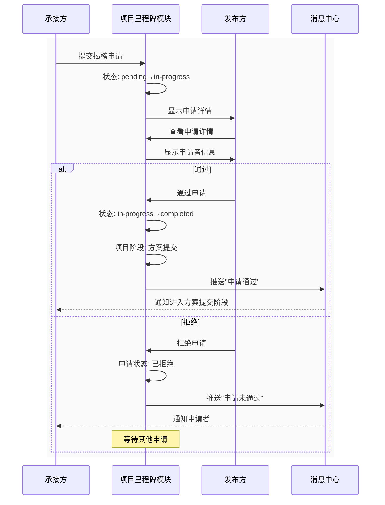
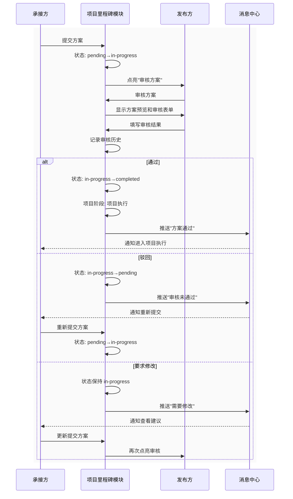
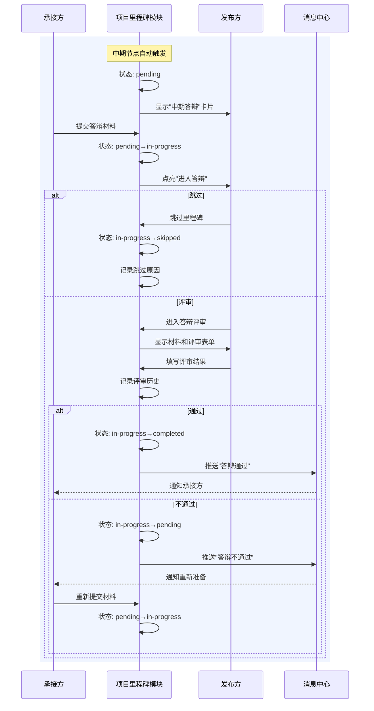
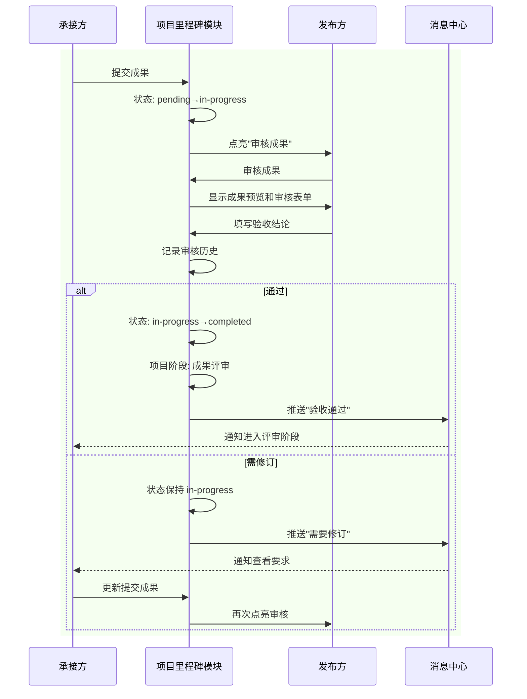
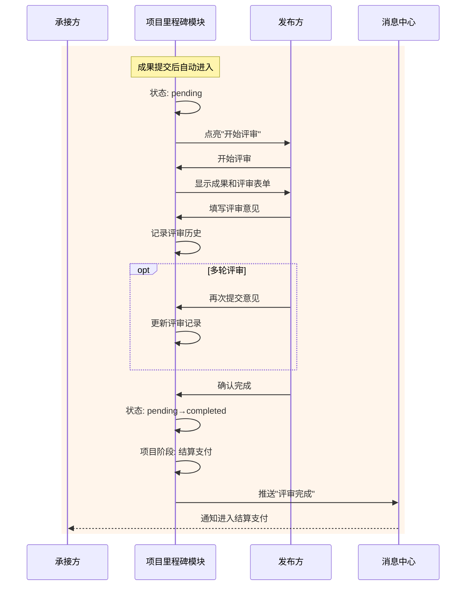
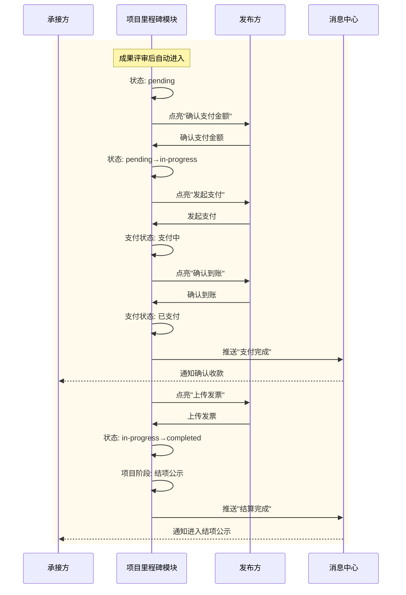
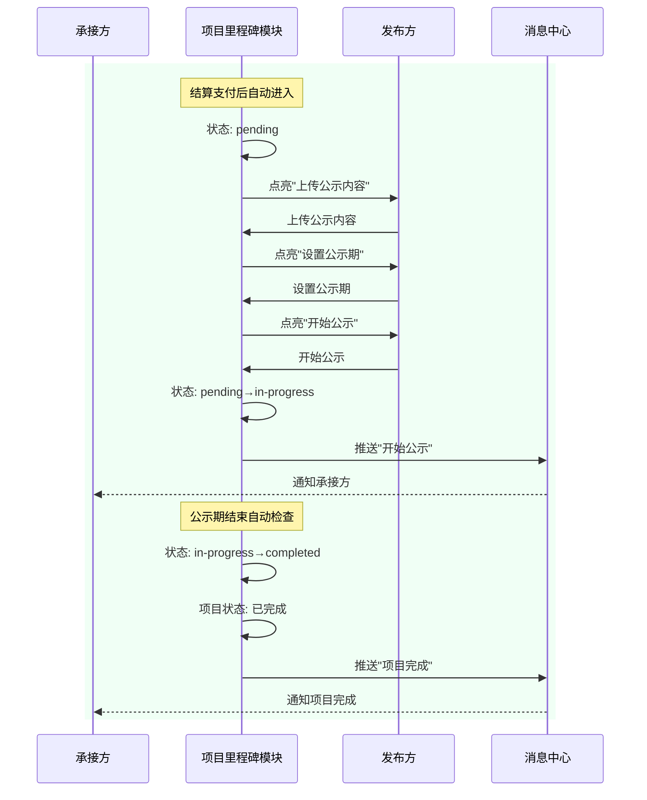
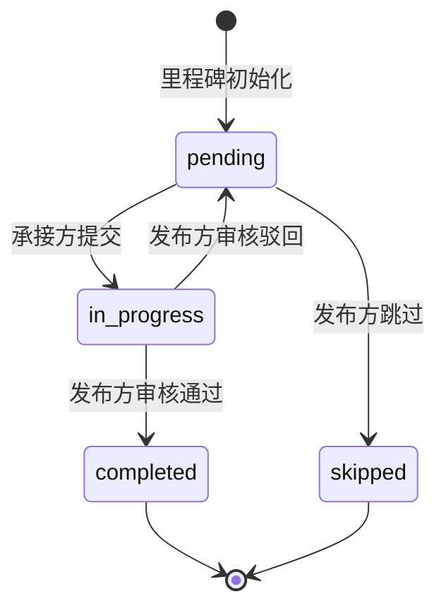

# 发布方里程碑交互设计

- **背景**：承接方的里程碑操作已在 `[109]承接方里程碑操作交互设计方案.md` 完整定义，但发布方尚缺乏逐节点的操作与审核体验说明，导致角色间交互不对称。
- **目标**：基于方案A（项目详情页中新增发布方专属操作区），明确每个里程碑节点发布方的可见信息、操作入口、与承接方的交互流以及状态同步机制，确保双方流程闭环。
- **时间戳**：2025-11-27 15:30（修正版）

---

## 目录

1. [设计原则](#1-设计原则)
2. [里程碑范围与总览](#2-里程碑范围与总览)
   - 2.1 [里程碑列表](#21-里程碑列表)
   - 2.2 [里程碑状态流转机制](#22-里程碑状态流转机制)
3. [里程碑详细工作流设计](#3-里程碑详细工作流设计)
   - 3.1 [揭榜征集里程碑（BIDDING）](#31-揭榜征集里程碑bidding)
   - 3.2 [方案提交里程碑（PROPOSAL_SUBMIT）](#32-方案提交里程碑proposal_submit)
   - 3.3 [中期答辩里程碑（MIDTERM_DEFENSE）](#33-中期答辩里程碑midterm_defense)
   - 3.4 [成果提交里程碑（FINAL_DELIVERY）](#34-成果提交里程碑final_delivery)
   - 3.5 [成果评审里程碑（FINAL_REVIEW）](#35-成果评审里程碑final_review)
   - 3.6 [结算支付里程碑（PAYMENT）](#36-结算支付里程碑payment)
   - 3.7 [结项公示里程碑（ANNOUNCEMENT）](#37-结项公示里程碑announcement)
4. [状态流转机制](#4-状态流转机制)
   - 4.1 [状态定义](#41-状态定义)
   - 4.2 [状态流转图](#42-状态流转图)
   - 4.3 [状态流转规则](#43-状态流转规则)
5. [审核历史数据结构](#5-审核历史数据结构)
   - 5.1 [审核历史记录结构](#51-审核历史记录结构)
   - 5.2 [审核历史查询](#52-审核历史查询)
6. [与承接方流程的衔接要点](#6-与承接方流程的衔接要点)
   - 6.1 [入口对齐](#61-入口对齐)
   - 6.2 [数据映射](#62-数据映射)
   - 6.3 [状态同步](#63-状态同步)
   - 6.4 [权限保障](#64-权限保障)
   - 6.5 [闭环检验](#65-闭环检验)
7. [项目全流程总时序图](#7-项目全流程总时序图)
   - 7.1 [流程说明](#71-流程说明)
   - 7.2 [关键节点](#72-关键节点)

---

## 1. 设计原则

1. **角色差异化**：发布方聚焦审核/反馈/记录，承接方聚焦提交/更新，界面元素按角色分区展示。
2. **就地操作**：所有审核动作在项目详情页 → "项目里程碑"卡片内完成，减少跳转。
3. **留痕机制**：每次审批、驳回、提醒都写入 `reviewHistory` 并可追溯，支持多轮审核循环。
4. **动态审核**：审核历史根据实际审核轮次动态增加，不限制审核次数。
5. **权限隔离**：仅 `role===enterprise && userId===publisherId` 可开启操作区，其余用户只读。
6. **防误操作**：关键操作（如跳过里程碑、确认支付）需要二次确认。

---

## 2. 里程碑范围与总览

### 2.1 里程碑列表

| 序号 | 里程碑名称 | 里程碑代码 | 触发条件 | 完成标准 | 是否可跳过 |
|------|-----------|-----------|---------|---------|-----------|
| 1 | 揭榜征集 | BIDDING | 项目发布后 | 发布方确认揭榜结果 | 否 |
| 2 | 方案提交 | PROPOSAL_SUBMIT | 发布方确认揭榜后 | 发布方审核通过方案 | 否 |
| 3 | 中期答辩 | MIDTERM_DEFENSE | 项目中期节点完成后规定时间 | 发布方评审通过 | 是（发布方控制） |
| 4 | 成果提交 | FINAL_DELIVERY | 承接方主动提交 | 发布方确认验收 | 否 |
| 5 | 成果评审 | FINAL_REVIEW | 成果提交完成后 | 发布方完成评审 | 否 |
| 6 | 结算支付 | PAYMENT | 成果评审完成后 | 发布方确认到账 | 否 |
| 7 | 结项公示 | ANNOUNCEMENT | 结算支付完成后 | 公示期结束无异议 | 否 |

### 2.2 里程碑状态流转机制

**基础状态**：
- `pending`：待开始（里程碑未开始）
- `in-progress`：进行中（承接方已提交，待发布方审核）
- `completed`：已完成（发布方审核通过，里程碑完成）
- `skipped`：已跳过（仅适用于可跳过的里程碑）

**状态流转规则**：
1. 初始状态为 `pending`
2. 承接方提交后，状态变为 `in-progress`
3. 发布方审核通过，状态变为 `completed`
4. 发布方审核驳回，状态回退为 `pending`（承接方需重新提交）
5. 可跳过的里程碑，发布方可选择跳过，状态变为 `skipped`

---

## 3. 里程碑详细工作流设计

### 3.1 揭榜征集里程碑（BIDDING）

#### 3.1.1 工作流概述
承接方提交揭榜申请 → 发布方查看申请列表 → 发布方审核申请 → 发布方确认揭榜结果 → 里程碑完成

#### 3.1.2 发布方可见信息
- 申请列表：申请者信息（姓名、学号、专业、技能标签、历史项目）
- 申请内容：揭榜理由、实施方案概述、团队信息（如团队揭榜）
- 申请时间：提交时间、申请状态
- 申请数量统计：总申请数、待审核数、已通过数

#### 3.1.3 发布方操作入口
- `查看申请详情`：查看单个申请的详细信息
- `通过申请`：确认该申请者/团队为承接方
- `拒绝申请`：拒绝该申请（需填写拒绝原因）
- `跳过此里程碑`：不适用（此里程碑不可跳过）

#### 3.1.4 详细交互流程

**流程步骤**：
1. **承接方提交申请**：承接方在项目详情页提交揭榜申请，系统记录申请信息
2. **发布方查看申请**：发布方进入项目详情页 → "项目里程碑"标签页，查看"揭榜征集"里程碑卡片
3. **发布方审核申请**：
   - 点击 `查看申请详情` → 弹出申请详情弹窗（显示申请者信息、申请内容）
   - 点击 `通过申请` → 弹出确认弹窗（二次确认）→ 确认后：
     - 里程碑状态变为 `completed`
     - 项目状态更新为"方案提交"阶段
     - 触发消息通知承接方："您的揭榜申请已通过"
   - 点击 `拒绝申请` → 弹出拒绝表单：
     - 必填：拒绝原因（文本输入，支持附件）
     - 提交后：
       - 申请状态标记为"已拒绝"
       - 触发消息通知申请者："您的揭榜申请未通过，原因：[拒绝原因]"
       - 里程碑状态保持 `in-progress`（等待其他申请或发布方选择）

4. **里程碑完成**：发布方确认承接方后，里程碑状态变为 `completed`，进入下一里程碑

#### 3.1.5 审核历史记录
```javascript
{
  reviewId: 'review-001',
  reviewerId: 'enterprise-001',
  reviewerName: '发布方名称',
  reviewTime: '2025-11-27 10:30:00',
  reviewResult: '通过', // '通过' | '拒绝'
  reviewComment: '申请理由充分，团队能力匹配',
  attachments: [] // 可选附件
}
```

#### 3.1.6 时序流程图



---

### 3.2 方案提交里程碑（PROPOSAL_SUBMIT）

#### 3.2.1 工作流概述
承接方提交方案 → 发布方审核方案 → [沟通反馈] → [承接方修改] → [再次审核] → ... → 发布方审核通过 → 里程碑完成

#### 3.2.2 发布方可见信息
- 方案概览：方案标题、技术栈、实施计划概述、提交时间
- 方案详情：方案大纲、技术方案、实施计划（甘特图/WBS）、团队分工、预期成果、风险评估等
- 附件列表：方案文档、参考资料、其他附件
- 提交历史：所有提交版本的记录（支持查看历史版本对比）

#### 3.2.3 发布方操作入口
- `审核方案`：主操作按钮（承接方提交后点亮）
- `查看方案详情`：查看完整方案内容
- `查看历史版本`：查看所有提交历史
- `跳过此里程碑`：不适用（此里程碑不可跳过）

#### 3.2.4 详细交互流程

**流程步骤**：
1. **承接方提交方案**：承接方在方案提交页完成提交，系统记录提交信息
2. **发布方查看方案**：发布方进入项目详情页 → "项目里程碑"标签页，查看"方案提交"里程碑卡片
3. **发布方审核方案**：
   - 点击 `审核方案` → 弹出审批弹窗：
     - 左侧：方案概览和附件预览（只读）
     - 右侧：审核表单
       - 审核结果（必选）：`通过` / `驳回` / `要求修改`
       - 审核意见（必填）：文本输入，支持附件上传
       - 是否提醒承接方（可选）：勾选后触发消息通知
   - 提交审核：
     - **审核通过**：
       - 里程碑状态变为 `completed`
       - 项目状态更新为"项目执行"阶段
       - 审核历史增加记录
       - 触发消息通知承接方："方案审核通过"
     - **审核驳回**：
       - 里程碑状态回退为 `pending`
       - 审核历史增加记录
       - 触发消息通知承接方："方案审核未通过，请根据反馈修改后重新提交"
     - **要求修改**：
       - 里程碑状态保持 `in-progress`
       - 审核历史增加记录
       - 触发消息通知承接方："方案需要修改，请查看审核意见"

4. **多轮审核循环**：
   - 如果驳回或要求修改，承接方修改后重新提交
   - 里程碑状态再次变为 `in-progress`
   - 发布方可以再次审核，审核历史动态增加
   - 重复步骤3，直到审核通过

5. **里程碑完成**：发布方审核通过后，里程碑状态变为 `completed`，进入下一里程碑

#### 3.2.5 审核历史记录
```javascript
{
  reviewId: 'review-002',
  reviewerId: 'enterprise-001',
  reviewerName: '发布方名称',
  reviewTime: '2025-11-27 11:00:00',
  reviewResult: '要求修改', // '通过' | '驳回' | '要求修改'
  reviewComment: '技术方案需要补充数据库设计部分，实施计划时间安排过于紧张',
  attachments: [
    { name: '修改建议清单.pdf', url: '...' }
  ],
  submissionVersion: 1 // 对应的提交版本号
}
```

#### 3.2.6 时序流程图



---

### 3.3 中期答辩里程碑（MIDTERM_DEFENSE）

#### 3.3.1 工作流概述
系统自动触发（项目中期节点完成后规定时间） → 承接方提交答辩材料 → 发布方评审 → [沟通反馈] → [承接方整改] → [再次评审] → ... → 发布方评审通过 → 里程碑完成

**注意**：此里程碑可由发布方选择跳过，跳过需填写原因。

#### 3.3.2 发布方可见信息
- 答辩材料：答辩PPT、演练视频、进度对比、问题清单
- 答辩信息：答辩时间、答辩地点、答辩形式（线上/线下）
- 提交历史：所有提交版本的记录

#### 3.3.3 发布方操作入口
- `进入中期答辩`：主操作按钮（承接方提交后点亮，跳转到独立评审页或侧栏全屏弹窗）
- `跳过此里程碑`：跳过操作（需填写跳过原因，二次确认）

#### 3.3.4 详细交互流程

**流程步骤**：
1. **里程碑触发**：系统在项目中期节点完成后规定时间自动触发，里程碑状态变为 `pending`
2. **承接方提交答辩材料**：承接方在中期答辩页提交答辩材料
3. **发布方评审**：
   - 点击 `进入中期答辩` → 跳转到独立评审页或侧栏全屏弹窗：
     - 左侧：答辩材料展示区（PPT预览、视频播放、文档查看）
     - 右侧：评审表单
       - 评审结果（必选）：`通过` / `不通过`
       - 评审意见（必填）：文本输入，支持附件上传
       - 亮点总结（可选）：文本输入
       - 问题清单（可选）：文本输入
       - 整改要求（可选）：文本输入（不通过时必填）
   - 提交评审：
     - **评审通过**：
       - 里程碑状态变为 `completed`
       - 审核历史增加记录
       - 触发消息通知承接方："中期答辩通过"
     - **评审不通过**：
       - 里程碑状态回退为 `pending`
       - 审核历史增加记录
       - 触发消息通知承接方："中期答辩不通过，请根据整改要求重新准备"

4. **多轮评审循环**：
   - 如果不通过，承接方整改后重新提交
   - 里程碑状态再次变为 `in-progress`
   - 发布方可以再次评审，审核历史动态增加
   - 重复步骤3，直到评审通过

5. **跳过里程碑**（可选）：
   - 发布方点击 `跳过此里程碑` → 弹出跳过确认弹窗：
     - 跳过原因（必填）：文本输入
     - 二次确认："确定跳过此里程碑吗？跳过后不可恢复"
   - 确认跳过：
     - 里程碑状态变为 `skipped`
     - 记录跳过原因
     - 时间轴上显示"已跳过"标记

6. **里程碑完成**：发布方评审通过后，里程碑状态变为 `completed`，进入下一里程碑

#### 3.3.5 审核历史记录
```javascript
{
  reviewId: 'review-003',
  reviewerId: 'enterprise-001',
  reviewerName: '发布方名称',
  reviewTime: '2025-11-27 14:00:00',
  reviewResult: '不通过', // '通过' | '不通过'
  reviewComment: '进度滞后，核心功能未完成，需要加快开发进度',
  highlights: '团队协作良好，技术选型合理', // 可选
  issues: '功能完成度不足，测试覆盖率低', // 可选
  rectificationRequirements: '需在两周内完成核心功能开发，并提交测试报告', // 可选
  attachments: [],
  submissionVersion: 1
}
```

#### 3.3.6 时序流程图



---

### 3.4 成果提交里程碑（FINAL_DELIVERY）

#### 3.4.1 工作流概述
承接方主动提交成果 → 发布方审核成果 → [沟通反馈] → [承接方修改] → [再次审核] → ... → 发布方确认验收 → 里程碑完成

#### 3.4.2 发布方可见信息
- 成果概览：成果标题、成果描述、提交时间
- 成果详情：最终代码、产品说明、测试报告、用户手册、部署地址、演示视频
- 附件列表：代码包、文档、视频等所有附件
- 提交历史：所有提交版本的记录

#### 3.4.3 发布方操作入口
- `审核成果`：主操作按钮（承接方提交后点亮）
- `查看成果详情`：查看完整成果内容
- `查看历史版本`：查看所有提交历史
- `跳过此里程碑`：不适用（此里程碑不可跳过）

#### 3.4.4 详细交互流程

**流程步骤**：
1. **承接方提交成果**：承接方在成果提交页完成提交，系统记录提交信息
2. **发布方查看成果**：发布方进入项目详情页 → "项目里程碑"标签页，查看"成果提交"里程碑卡片
3. **发布方审核成果**：
   - 点击 `审核成果` → 弹出审批弹窗：
     - 左侧：成果概览和附件预览（只读）
     - 右侧：审核表单
       - 验收结论（必选）：`通过` / `需修订`
       - 审核意见（必填）：文本输入，支持附件上传
       - 分步骤验收（可选）：
         - 功能验收：`通过` / `需修订`
         - 文档验收：`通过` / `需修订`
         - 部署验收：`通过` / `需修订`
       - 是否提醒承接方（可选）：勾选后触发消息通知
   - 提交审核：
     - **验收通过**：
       - 里程碑状态变为 `completed`
       - 项目状态更新为"成果评审"阶段
       - 审核历史增加记录
       - 触发消息通知承接方："成果验收通过，进入评审阶段"
     - **需修订**：
       - 里程碑状态保持 `in-progress`
       - 审核历史增加记录
       - 触发消息通知承接方："成果需要修订，请查看审核意见"

4. **多轮审核循环**：
   - 如果需要修订，承接方修改后重新提交
   - 里程碑状态保持 `in-progress`
   - 发布方可以再次审核，审核历史动态增加
   - 重复步骤3，直到验收通过

5. **里程碑完成**：发布方验收通过后，里程碑状态变为 `completed`，进入下一里程碑

#### 3.4.5 审核历史记录
```javascript
{
  reviewId: 'review-004',
  reviewerId: 'enterprise-001',
  reviewerName: '发布方名称',
  reviewTime: '2025-11-27 15:00:00',
  reviewResult: '需修订', // '通过' | '需修订'
  reviewComment: '功能验收通过，但文档不完整，需要补充API文档和部署说明',
  stepReviews: {
    function: '通过',
    document: '需修订',
    deployment: '通过'
  },
  attachments: [],
  submissionVersion: 1
}
```

#### 3.4.6 时序流程图



---

### 3.5 成果评审里程碑（FINAL_REVIEW）

#### 3.5.1 工作流概述
成果提交完成后自动进入 → 发布方评审成果 → [多轮评审] → 发布方完成评审 → 里程碑完成

#### 3.5.2 发布方可见信息
- 成果信息：承接方提交的所有成果内容（代码、文档、测试报告等）
- 评审材料：成果提交里程碑中的所有材料
- 评审历史：所有评审记录

#### 3.5.3 发布方操作入口
- `开始评审`：主操作按钮（成果提交完成后点亮）
- `查看成果详情`：查看完整成果内容
- `跳过此里程碑`：不适用（此里程碑不可跳过）

#### 3.5.4 详细交互流程

**流程步骤**：
1. **里程碑触发**：成果提交里程碑完成后，自动进入成果评审阶段，里程碑状态变为 `pending`
2. **发布方开始评审**：
   - 点击 `开始评审` → 弹出评审弹窗：
     - 左侧：成果内容展示（只读）
     - 右侧：评审表单
       - 评审结果（必选）：`通过` / `不通过`
       - 评审意见（必填）：文本输入，支持附件上传
       - 具体评价（可选）：文本输入（如功能完整性、技术质量、创新性等）
   - 提交评审：
     - 里程碑状态变为 `completed`
     - 审核历史增加记录
     - 触发消息通知承接方："成果评审完成"

3. **多轮评审**（如需要）：
   - 发布方可以多次提交评审意见，每次提交都会增加审核历史记录
   - 直到发布方确认评审完成

4. **里程碑完成**：发布方完成评审后，里程碑状态变为 `completed`，进入下一里程碑

#### 3.5.5 审核历史记录
```javascript
{
  reviewId: 'review-005',
  reviewerId: 'enterprise-001',
  reviewerName: '发布方名称',
  reviewTime: '2025-11-27 16:00:00',
  reviewResult: '通过', // '通过' | '不通过'
  reviewComment: '成果质量优秀，功能完整，技术实现合理，文档齐全',
  specificEvaluation: '功能完整性：优秀；技术质量：良好；创新性：一般',
  attachments: []
}
```

#### 3.5.6 时序流程图



---

### 3.6 结算支付里程碑（PAYMENT）

#### 3.6.1 工作流概述
成果评审完成后自动进入 → 发布方确认支付金额 → 发布方发起支付指令 → 发布方确认到账 → 发布方上传发票 → 里程碑完成

#### 3.6.2 发布方可见信息
- 支付信息：项目奖金、实际支付金额、支付状态
- 支付记录：支付时间、支付方式、支付凭证
- 发票信息：发票状态、发票文件

#### 3.6.3 发布方操作入口
- `确认支付金额`：确认最终支付金额（默认项目奖金，可调整）
- `发起支付`：发起支付指令（需二次确认）
- `确认到账`：确认承接方已收到款项
- `上传发票`：上传发票文件
- `跳过此里程碑`：不适用（此里程碑不可跳过）

#### 3.6.4 详细交互流程

**流程步骤**：
1. **里程碑触发**：成果评审里程碑完成后，自动进入结算支付阶段，里程碑状态变为 `pending`
2. **发布方确认支付金额**：
   - 点击 `确认支付金额` → 弹出金额确认弹窗：
     - 项目奖金（只读）：显示项目原始奖金
     - 实际支付金额（可编辑）：默认等于项目奖金，可调整（如扣除违约金、增加奖励）
     - 调整说明（可选）：文本输入，说明调整原因
   - 确认后：
     - 记录支付金额
     - 里程碑状态变为 `in-progress`

3. **发布方发起支付**：
   - 点击 `发起支付` → 弹出二次确认弹窗："确定发起支付吗？支付金额：[金额]"
   - 确认后：
     - 记录支付指令
     - 支付状态更新为"支付中"
     - 审核历史增加记录："已发起支付指令，金额：[金额]"

4. **发布方确认到账**：
   - 点击 `确认到账` → 弹出确认弹窗："确认承接方已收到款项吗？"
   - 确认后：
     - 支付状态更新为"已支付"
     - 审核历史增加记录："已确认到账"
     - 触发消息通知承接方："支付已完成，请确认收款"

5. **发布方上传发票**：
   - 点击 `上传发票` → 弹出上传弹窗：
     - 发票文件（必填）：文件上传
     - 发票说明（可选）：文本输入
   - 提交后：
     - 记录发票信息
     - 审核历史增加记录："已上传发票"

6. **里程碑完成**：所有步骤完成后，里程碑状态变为 `completed`，进入下一里程碑

#### 3.6.5 审核历史记录
```javascript
{
  reviewId: 'review-006',
  reviewerId: 'enterprise-001',
  reviewerName: '发布方名称',
  reviewTime: '2025-11-27 17:00:00',
  action: '确认支付金额', // '确认支付金额' | '发起支付' | '确认到账' | '上传发票'
  paymentAmount: 10000,
  adjustmentReason: '项目完成质量优秀，增加奖励1000元',
  invoiceFile: { name: 'invoice.pdf', url: '...' },
  attachments: []
}
```

#### 3.6.6 时序流程图



---

### 3.7 结项公示里程碑（ANNOUNCEMENT）

#### 3.7.1 工作流概述
结算支付完成后自动进入 → 发布方上传公示内容 → 发布方设置公示期 → 公示开始 → 公示期结束无异议 → 里程碑完成

#### 3.7.2 发布方可见信息
- 公示内容：公示标题、公示正文、公示附件
- 公示设置：公示开始时间、公示结束时间、公示期天数
- 公示状态：公示中、公示结束

#### 3.7.3 发布方操作入口
- `上传公示内容`：上传公示内容（标题、正文、附件）
- `设置公示期`：设置公示期天数
- `开始公示`：开始公示（需二次确认）
- `跳过此里程碑`：不适用（此里程碑不可跳过）

#### 3.7.4 详细交互流程

**流程步骤**：
1. **里程碑触发**：结算支付里程碑完成后，自动进入结项公示阶段，里程碑状态变为 `pending`
2. **发布方上传公示内容**：
   - 点击 `上传公示内容` → 弹出上传弹窗：
     - 公示标题（必填）：文本输入
     - 公示正文（必填）：富文本输入，支持附件上传
     - 公示附件（可选）：文件上传
   - 提交后：
     - 记录公示内容
     - 审核历史增加记录："已上传公示内容"

3. **发布方设置公示期**：
   - 点击 `设置公示期` → 弹出设置弹窗：
     - 公示期天数（必填）：数字输入（默认7天，可调整）
   - 提交后：
     - 记录公示期设置
     - 计算公示结束时间
     - 审核历史增加记录："已设置公示期：[天数]天"

4. **发布方开始公示**：
   - 点击 `开始公示` → 弹出二次确认弹窗："确定开始公示吗？公示期：[天数]天"
   - 确认后：
     - 公示状态更新为"公示中"
     - 公示开始时间记录
     - 里程碑状态变为 `in-progress`
     - 审核历史增加记录："已开始公示"
     - 触发消息通知承接方："项目已开始公示"

5. **公示期结束**：
   - 系统在公示期结束后自动检查是否有申诉
   - 若无异议：
     - 公示状态更新为"公示结束"
     - 里程碑状态变为 `completed`
     - 项目状态更新为"已完成"
     - 触发消息通知承接方："项目公示结束，项目已完成"

6. **里程碑完成**：公示期结束无异议后，里程碑状态变为 `completed`，项目完成

#### 3.7.5 审核历史记录
```javascript
{
  reviewId: 'review-007',
  reviewerId: 'enterprise-001',
  reviewerName: '发布方名称',
  reviewTime: '2025-11-27 18:00:00',
  action: '开始公示', // '上传公示内容' | '设置公示期' | '开始公示'
  announcementTitle: '项目结项公示',
  announcementContent: '...',
  announcementPeriod: 7, // 天数
  attachments: []
}
```

#### 3.7.6 时序流程图



---

## 4. 状态流转机制

### 4.1 状态定义

| 状态 | 状态代码 | 说明 | 适用场景 |
|------|---------|------|---------|
| 待开始 | `pending` | 里程碑尚未开始或承接方未提交 | 初始状态、驳回后重新提交前 |
| 进行中 | `in-progress` | 承接方已提交，待发布方审核 | 承接方提交后、要求修改后 |
| 已完成 | `completed` | 发布方审核通过，里程碑完成 | 审核通过后 |
| 已跳过 | `skipped` | 发布方选择跳过此里程碑 | 仅适用于可跳过的里程碑 |

### 4.2 状态流转图



### 4.3 状态流转规则

1. **初始状态**：所有里程碑初始状态为 `pending`
2. **提交触发**：承接方提交后，状态变为 `in-progress`
3. **审核通过**：发布方审核通过，状态变为 `completed`
4. **审核驳回**：发布方审核驳回，状态回退为 `pending`（承接方需重新提交）
5. **要求修改**：发布方要求修改，状态保持 `in-progress`（承接方可更新提交）
6. **跳过操作**：仅可跳过的里程碑，发布方可选择跳过，状态变为 `skipped`

---

## 5. 审核历史数据结构

### 5.1 审核历史记录结构

```javascript
{
  // 基础信息
  reviewId: 'review-001',              // 审核记录ID（唯一）
  milestoneCode: 'PROPOSAL_SUBMIT',     // 所属里程碑代码
  reviewerId: 'enterprise-001',         // 审核人ID
  reviewerName: '发布方名称',            // 审核人名称
  reviewTime: '2025-11-27 10:30:00',   // 审核时间
  
  // 审核结果
  reviewResult: '通过',                 // '通过' | '驳回' | '要求修改' | '不通过' | '需修订'
  reviewComment: '审核意见内容',         // 审核意见（必填，文本，支持附件）
  attachments: [                        // 附件列表（可选）
    {
      name: '修改建议清单.pdf',
      url: 'https://...',
      size: '1024KB'
    }
  ],
  
  // 关联信息
  submissionVersion: 1,                 // 对应的提交版本号
  action: '审核方案',                   // 操作动作（如"审核方案"、"确认支付金额"等）
  
  // 扩展字段（根据里程碑类型不同而不同）
  // 例如：支付金额、公示内容、跳过原因等
  paymentAmount: 10000,                 // 支付金额（结算支付里程碑）
  adjustmentReason: '调整说明',          // 调整说明（结算支付里程碑）
  announcementTitle: '公示标题',         // 公示标题（结项公示里程碑）
  announcementContent: '公示内容',       // 公示内容（结项公示里程碑）
  announcementPeriod: 7,                // 公示期天数（结项公示里程碑）
  skipReason: '跳过原因',                // 跳过原因（跳过里程碑时）
  
  // 评审相关字段（中期答辩、成果评审）
  highlights: '亮点总结',                // 亮点总结（中期答辩）
  issues: '问题清单',                   // 问题清单（中期答辩）
  rectificationRequirements: '整改要求', // 整改要求（中期答辩）
  specificEvaluation: '具体评价',        // 具体评价（成果评审）
  
  // 分步骤验收（成果提交）
  stepReviews: {
    function: '通过',                   // 功能验收
    document: '需修订',                 // 文档验收
    deployment: '通过'                  // 部署验收
  }
}
```

### 5.2 审核历史查询

- **按里程碑查询**：根据里程碑代码查询该里程碑的所有审核记录
- **按时间排序**：审核记录按时间倒序排列（最新的在前）
- **版本关联**：审核记录关联对应的提交版本号，支持查看历史版本对比

---

## 6. 与承接方流程的衔接要点

### 6.1 入口对齐
- 两端均在项目详情页 → "项目里程碑"标签页
- 承接方有"提交/更新"按钮，发布方有"审核/反馈"按钮
- 按钮互斥显示（承接方提交后，发布方按钮点亮；发布方审核后，承接方可再次提交）

### 6.2 数据映射
- 承接方提交表单字段在发布方弹窗中只读展示
- 发布方补充的评语与整改要求回写至承接方视图的"发布方反馈"区域
- 审核历史记录双方均可查看（但发布方的内部备注仅发布方可见）

### 6.3 状态同步
- 承接方提交 → 里程碑状态切为 `in-progress` 并标记"待发布方审核"
- 发布方操作成功 → 根据结果更新状态并回写至承接方视图
- 数据同步方式：后端更新后，前端界面刷新即可看到新数据

### 6.4 权限保障
- 承接方无法编辑发布方备注/内部附件
- 发布方也无法修改承接方提交内容，只能通过驳回要求其重新提交
- 关键操作（如跳过里程碑、确认支付）需要二次确认，防止误操作

### 6.5 闭环检验
- 每个里程碑需满足"承接方提交 → 发布方审核 → 双方确认"三步，才能推动项目阶段前进
- 系统应在任一步缺失时提示"当前里程碑尚未闭环"
- 里程碑完成后，自动进入下一里程碑（如需要）

---

## 7. 项目全流程总时序图

以下时序图展示从项目开始到结束的完整里程碑流程，包含发布方与承接方的所有交互节点：

```mermaid
sequenceDiagram
    participant S as 承接方
    participant UI as 项目里程碑模块
    participant P as 发布方
    participant MSG as 消息中心

    rect rgb(250,250,250)
        S->>UI: 提交揭榜申请
        UI->>P: 显示申请列表
        P->>UI: 审核申请
        alt 通过
            UI->>UI: 状态: completed
            UI->>MSG: 推送"申请通过"
            MSG-->>S: 通知承接方
        end
    end

    rect rgb(240,248,255)
        S->>UI: 提交方案
        UI->>P: 点亮"审核方案"
        P->>UI: 审核方案
        alt 通过
            UI->>UI: 状态: completed
            UI->>MSG: 推送"方案通过"
        else 驳回
            UI->>MSG: 推送"需修改"
            MSG-->>S: 通知修改
            S->>UI: 重新提交
        end
    end

    rect rgb(240,245,255)
        Note over UI: 中期节点自动触发
        UI->>P: 显示"中期答辩"
        alt 跳过
            P->>UI: 跳过里程碑
            UI->>UI: 状态: skipped
        else 正常流程
            S->>UI: 提交答辩材料
            P->>UI: 评审
            alt 通过
                UI->>UI: 状态: completed
                UI->>MSG: 推送"答辩通过"
            else 不通过
                UI->>MSG: 推送"需整改"
                S->>UI: 重新提交
            end
        end
    end

    rect rgb(245,255,240)
        S->>UI: 提交成果
        UI->>P: 点亮"审核成果"
        P->>UI: 审核成果
        alt 通过
            UI->>UI: 状态: completed
            UI->>MSG: 推送"验收通过"
        else 需修订
            UI->>MSG: 推送"需修订"
            S->>UI: 更新提交
        end
    end

    rect rgb(255,245,235)
        Note over UI: 自动进入评审
        UI->>P: 点亮"开始评审"
        P->>UI: 评审成果
        UI->>UI: 状态: completed
        UI->>MSG: 推送"评审完成"
    end

    rect rgb(255,250,240)
        Note over UI: 自动进入支付
        UI->>P: 点亮"确认金额"
        P->>UI: 确认支付金额
        UI->>P: 点亮"发起支付"
        P->>UI: 发起支付
        UI->>P: 点亮"确认到账"
        P->>UI: 确认到账
        UI->>MSG: 推送"支付完成"
        UI->>P: 点亮"上传发票"
        P->>UI: 上传发票
        UI->>UI: 状态: completed
    end

    rect rgb(240,255,245)
        Note over UI: 自动进入公示
        UI->>P: 点亮"上传内容"
        P->>UI: 上传公示内容
        UI->>P: 点亮"设置公示期"
        P->>UI: 设置公示期
        UI->>P: 点亮"开始公示"
        P->>UI: 开始公示
        UI->>UI: 状态: in-progress
        UI->>MSG: 推送"开始公示"
        
        Note over UI: 公示期结束自动检查
        UI->>UI: 状态: completed
        UI->>UI: 项目状态: 已完成
        UI->>MSG: 推送"项目完成"
    end
```



### 7.1 流程说明

1. **里程碑顺序**：里程碑按顺序完成，但允许跳过某些里程碑（仅发布方可控制，如中期答辩）
2. **多轮审核**：每个里程碑可能经历多轮"提交-审核-反馈-修改"循环，直到发布方审核通过
3. **状态流转**：每个里程碑的状态从 `pending` → `in-progress` → `completed`（或 `skipped`）
4. **自动触发**：部分里程碑由系统自动触发（如中期答辩、成果评审、结算支付、结项公示）
5. **消息通知**：每个关键节点都会触发消息通知，确保双方及时了解进度

### 7.2 关键节点

- **揭榜征集**：确定项目承接方，项目正式开始
- **方案提交**：确定项目实施方案，进入执行阶段
- **中期答辩**：项目中期检查点（可选）
- **成果提交**：项目成果交付
- **成果评审**：对项目成果进行评审
- **结算支付**：完成项目资金结算
- **结项公示**：项目正式结项，对外公示

---

**文档结束**
